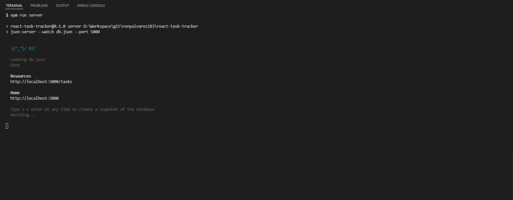
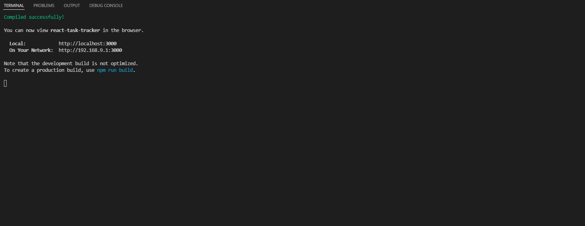
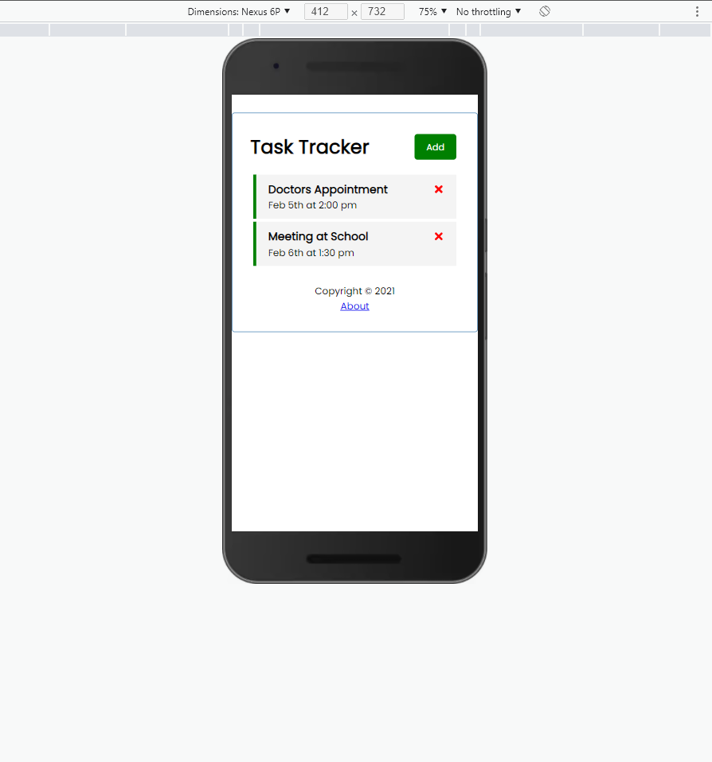
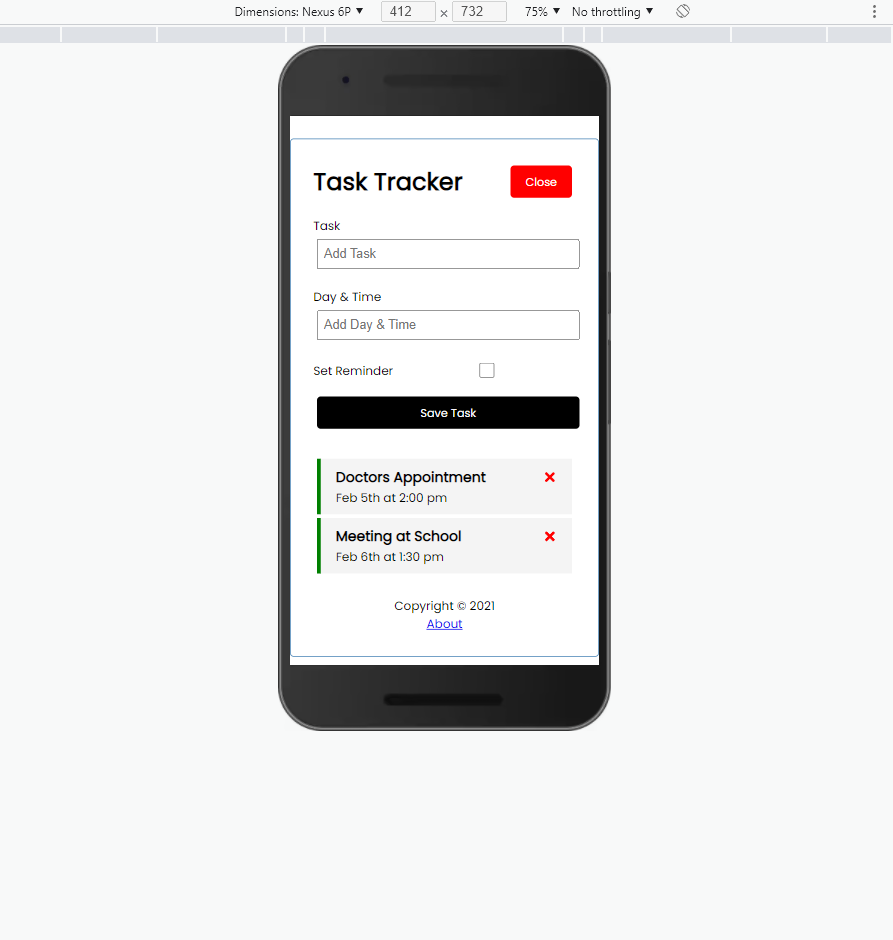
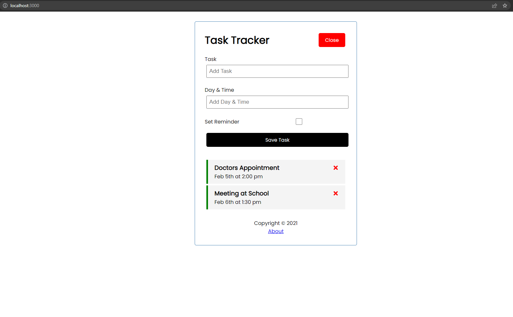

# React Task Tracker App

This project includes the react ui as well as JSON-server for the backend

## Table of contents
1. [Objectives](#objectives)
2. [Prerequisites](#prerequisites)
3. [Build and test the application](#build-and-test-the-application)
4. [Screenshots](#screenshots)
5. [Recommended content](#recommended-content)

## Objectives
1. Set up a full REST API using JSON Server, with Create, Read, Update, and Delete endpoints.
2. Call each one of those endpoints from the front end using React.

## Prerequisites
* NPM (Node package manager)
* Json Server, version 0.17.0

## Build and test the application

### Install dependencies

```
npm install
```

### Run the JSON server (http://localhost:5000)

```
npm run server
```



### Run React dev server (http://localhost:3000)

```
npm start
```



## Screenshots

This is what the app looks like on mobile devices:





And this is what it looks like on other devices:



## Recommended content
* [Set up a full REST API in less than 30 seconds](https://www.npmjs.com/package/json-server)
